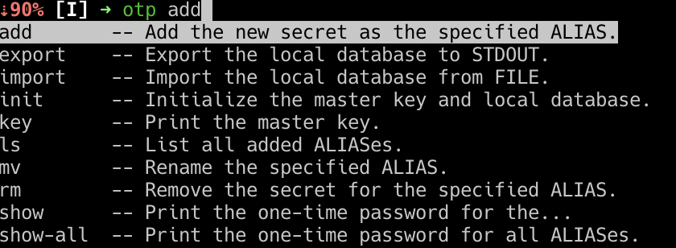

# One Time Password (OTP, TOTP/HOTP)

[](https://www.python.org/downloads/release/python-3100/)
[](https://github.com/psf/black)
[](https://pdm.fming.dev)
[](https://github.com/pre-commit/pre-commit)

---
OTP serves as additional protection in case of password leaks.

`onetimepass` allows you to manage OTP codes and generate a master key.
The master key allows the base to be decrypted and encrypted. Make sure to keep it in a safe place, otherwise it will not be possible to recover the data.

`onetimepass` supports as an optional dependency the integration with the system keychain (cross-platform) in which the application saves the master key.

## Requirements

- Python 3.10+
- PDM 1.11+

## Installation

```console
$ pdm install
```

To include the optional keychain support:
```console
$ pdm install -G keyring
```

## Usage


### Initialize database

At the very beginning, the database must be initialised, which additionally creates the master key.
It will save it to the keychain if this has been installed.

By default, it will print the generated key to the STDOUT. You need this behavior if you don't use the optional keychain integration.

If you do, you can pass the `-q, --quiet` option to silence the output.


### Keychain integration

The application will automatically detect if you have the keychain integration installed, however, if you want to force enable/disable it, you can by using respectively the `-k, --keyring` and `-K, --no-keyring` options.

Although, if you don't have the keychain integration installed, enabling it won't work:


### Print the master key

It is possible to print the current master key stored in the keychain (if you need this for e.g. migrating the app to the different device).

This of course won't work if you don't use the keychain integration.


### Adding new OTP alias

`onetimepass` identifies the added OTP codes via the user-specified _aliases_, which should be short, easy-to-remember names.

`onetimepass` allows you to add new alias in two ways, either by specifying all the parameters manually, using `add hotp` or `add totp` commands (depending on which type of the OTP you want to add), or by providing the [de facto standard URI](https://github.com/google/google-authenticator/wiki/Key-Uri-Format) invented by the Google.

#### Adding via URI (command will aks interactively for the URI)
```console
$ pdm run otp add uri AWS-root
Enter URI:
Repeat for confirmation:
```

Example URIs

* TOTP: [otpauth://totp/ACME%20Co:john@example.com?secret=HXDMVJECJJWSRB3HWIZR4IFUGFTMXBOZ&issuer=ACME%20Co&algorithm=SHA1&digits=6&period=30]()
* HOTP: [otpauth://totp/ACME%20Co:john@example.com?secret=HXDMVJECJJWSRB3HWIZR4IFUGFTMXBOZ&issuer=ACME%20Co&algorithm=SHA1&digits=6&period=30]()

#### Adding via totp/hotp subcommand (command will ask interactively for the secret):
```console
$ pdm run otp add totp AWS-root
Enter secret:
Repeat for confirmation:
$ pdm run otp add hotp AWS-root
Enter secret:
Repeat for confirmation:
```

### Removing OTP alias

```console
$ pdm run otp rm <alias>
Are you sure? [y/N]:
```

To omit the interactive confirmation (⚠️ **unsafe!**), pas the `--yes` option.

### Showing OTP code

Show single OTP by alias

```console
$ pdm run otp show <alias>
```


You can force the app to wait until the new OTP code is valid, in case the current one will be invalid in a short period
of time (so you won't have to rush with copy-pasting the code, or wait manually), using `-w, --wait-for-next` option.

```console
$ pdm run otp show -w <seconds> <alias>
```

This will accept the _seconds_ of tolerance (if the remaining time of the current code to be valid is less than
_seconds_, the app will wait, otherwise it will show the current code).


The value returned by the command can be used to copy it straight to the clipboard or be otherwise automated.

Show all codes (using external watcher):
```console
$ watch -c -p -n 1 pdm run otp show-all
```


### Database import/export

In case you want to migrate the application to the different device, you can export the local database to the format of choice (currently only the `json` is supported) and then import it.


### Shell Completion

`onetimepass` can provide tab completion for commands, options, and choice values. Bash, Zsh, and Fish are supported

```console
$ pdm run zsh
$ eval "$(_OTP_COMPLETE=zsh_source otp)"
```

```console
$ pdm run bash
$ eval "$(_OTP_COMPLETE=bash_source otp)"
```


